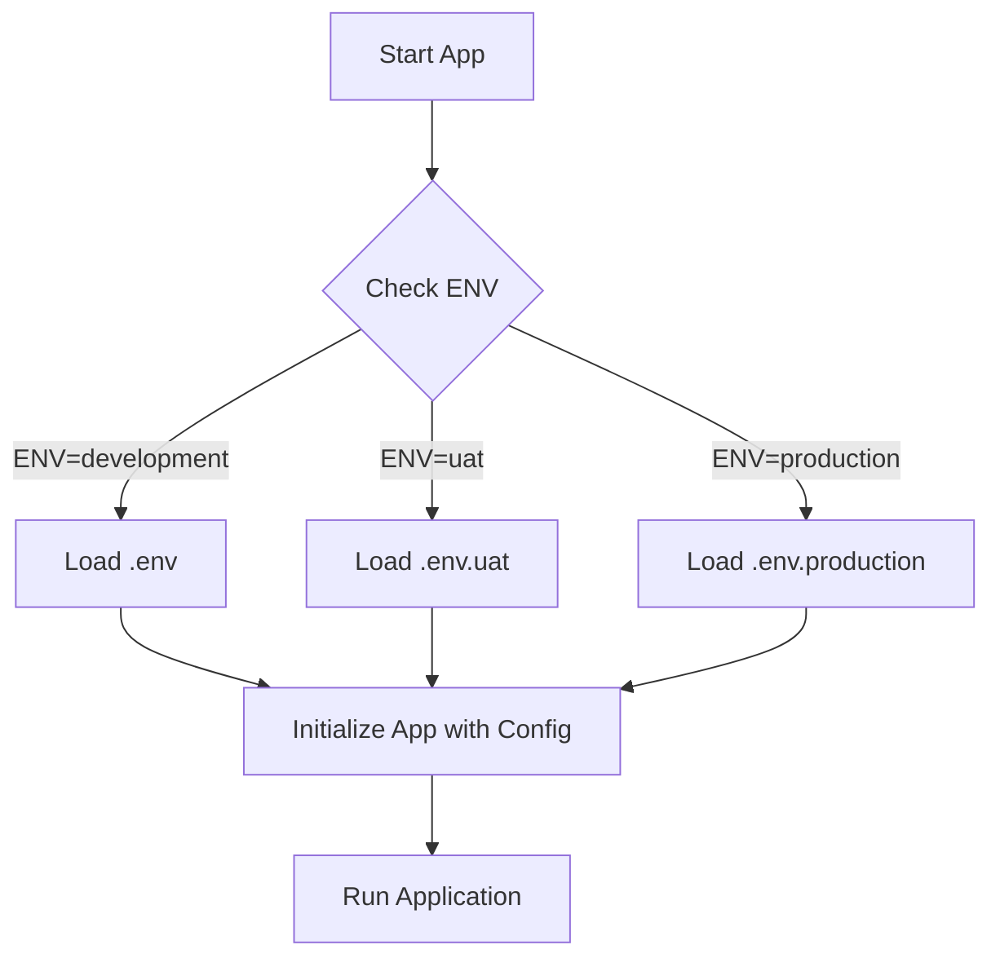

# Environment Configuration Guide

This document explains how to manage different environments in the Flutter application.

## Purpose

Environment configuration is essential for:

1. **Environment-Specific Settings**
   - Different API endpoints for dev/UAT/production
   - Environment-specific feature flags
   - Third-party service configurations

2. **Security**
   - Keep sensitive data out of version control
   - Use different API keys per environment
   - Protect production credentials

3. **Developer Experience**
   - Easy switching between environments
   - Consistent setup across team members
   - Simplified deployment process

## Quick Start

```dart
// 1. Access env variables anywhere in your app
import 'package:flutter_dotenv/flutter_dotenv';

class ApiService {
  static String get baseUrl => dotenv.get('API_URL');
  static String get apiKey => dotenv.get('API_KEY');
}

// 2. Initialize in main.dart
Future<void> main() async {
  // Load env variables before running the app
  await dotenv.load(fileName: 'env/.env');
  
  runApp(const MyApp());
}
```

## Available Environments

- **Development** (Default)
  - File: `env/.env`
  - Used for local development
  - Default API: `https://jsonplaceholder.typicode.com`

- **UAT**
  - File: `env/.env.uat`
  - Used for User Acceptance Testing
  - Example API: `https://api.uat.yourdomain.com`

- **Production**
  - File: `env/.env.production`
  - Used for production deployment
  - Example API: `https://api.production.com`

## How to Switch Environments

### 1. Using PowerShell (Recommended for Windows)

#### Useful PowerShell Commands:
```powershell
# List available devices
flutter devices

# Build APK for UAT
flutter build apk --dart-define=ENV=uat --release

# Build App Bundle for Play Store
flutter build appbundle --dart-define=ENV=production --release

# Install release APK on connected device
flutter install --release --dart-define=ENV=production
```

### 2. Using VS Code

1. Open `.vscode/launch.json`
2. Add configurations for each environment:

```json
{
  "version": "0.2.0",
  "configurations": [
    {
      "name": "Development",
      "request": "launch",
      "type": "dart",
      "args": ["--dart-define=ENV=development"]
    },
    {
      "name": "UAT",
      "request": "launch",
      "type": "dart",
      "args": ["--dart-define=ENV=uat"]
    }
  ]
}
```

### 3. Using Environment Variables

```bash
# Linux/macOS
export ENV=uat

# Windows Command Prompt
set ENV=uat

# Windows PowerShell
$env:ENV="uat"

# Then run your app
flutter run
```

## Environment Architecture

### 1. Configuration Flow



### 2. Environment File Structure

```
env/
  ├── .env           # Development (versioned)
  ├── .env.uat       # UAT (versioned)
  └── .env.production # Production (versioned)
```
