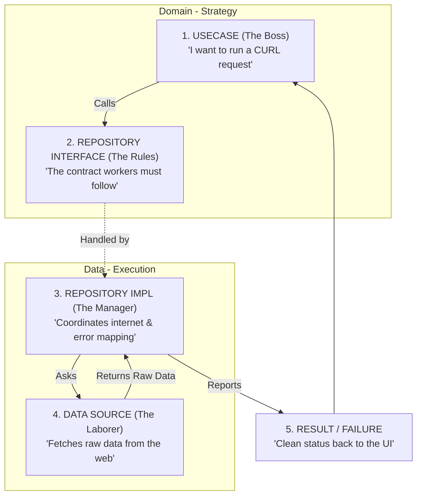

# CC SDK Core

A core SDK package that provides essential functionality and utilities for Flutter applications. This package is part of a larger ecosystem that includes `cc_sdk_ui` for UI components.

## Features

- **Core Functionality**
  - Network utilities (CURL, interceptors)
  - Device information
  - Common extensions and helpers
  - Serialization (GSON)
  - Error handling and failure management (Clean Architecture)

## Architecture Flow (The "Chain of Command")

This SDK follows **Clean Architecture** to keep the code organized and easy to test. Think of it like a company:

### 1. Domain Layer (The "Brains")
*   **The Boss (UseCase):** Decides *what* to do (e.g., `ExecuteCurlRequest`). It doesn't know how the internet works; it just gives the command.
*   **The Rules (Repository Interface):** Defines the contract. Every worker must follow these rules.

### 2. Data Layer (The "Workers")
*   **The Manager (Repository Implementation):** Coordinates everything. It checks if the internet is on, asks the worker to fetch data, and translates errors into clean reports.
*   **The Laborer (DataSource):** Does the heavy lifting. It talks directly to the server and returns raw data.

### 3. Core Layer
*   **The Failures:** Standardized error reports (e.g., `NetworkFailure`, `ServerFailure`, `AppConfigFailure`) that the Boss (UI) can easily understand.

### Visual Flow



## Installation

Add to your `pubspec.yaml`:

```yaml
dependencies:
  cc_sdk:
    path: ../path/to/cc_sdk
  cc_sdk_ui:  # For UI components
    path: ../path/to/cc_sdk_ui
```

## Usage

### Core Functionality

```dart
import 'package:cc_sdk/core/network/network_info.dart';
import 'package:cc_sdk/core/utils/common/device_utils.dart';

// Check network connectivity
final isConnected = await NetworkInfo().isConnected;

// Get device info
final deviceInfo = await DeviceUtils.getDeviceInfo();
```

### Error Handling

#### General Failures
```dart
import 'package:cc_sdk/core/failure/failure.dart';
import 'package:multiple_result/multiple_result.dart';

class MyUseCase {
  Future<Result<String, Failure>> getData() async {
    try {
      // Your implementation
      return Success("Data fetched");
    } catch (e) {
      return Error(ServerFailure(e.toString()));
    }
  }
}
```

#### Configuration Failures (Modern Pattern Matching)
```dart
import 'package:cc_sdk/core/failure/app_config/app_config_failure.dart';

void handleConfigError(AppConfigFailure failure) {
  switch (failure) {
    case MissingConfigFailure():
      print('Missing key: ${failure.key}');
    case InvalidConfigFailure():
      print('Invalid value for ${failure.key}: ${failure.actualValue}');
    case SecurityConfigFailure():
      print('Security issue: ${failure.message}');
    case ConfigFailure():
      print('General config error: ${failure.message}');
  }
}
```

## Dependencies

- `connectivity_plus`: For network status monitoring
- `dio`: For HTTP requests
- `device_info_plus`: For device information
- `crypto`: For hashing utilities
- `equatable`: For value equality
- `google_fonts`: For text styling
- `intl`: For internationalization
- `multiple_result`: For better error handling
- `package_info_plus`: For app package information

NOTICE that :

a. Distribution : Everytime distribute latest source code to sub-project, MUST increase version in `pubspec.yaml`

b. If there are duplicated|oldest `cc_library` module in section `Dart Packages` (at Project tab)
    
Sometimes it happens when IDE can not know where is latest version.
    
Try to get latest version by using :

* Solution 1 :
    - MUST run `flutter clean` in module `widget` & `root` project
    - MUST invalidate & restart IDE (if has)
    - MUST `flutter pub cache clean` to clean old version
    - MUST `flutter pub upgrade` in module `widget` & `root` project, to get latest version
    - MUST `flutter pub get` in module `widget` & `root` project

* Solution 2 : (FAST STEP)
    - Guarantee commit|push all code
    - Delete current project
    - Then get latest project by using `git clone https://coc.mobile.erp.git` at : https://coc.mobile.erp/src/master/
    - Switch to correct branch, ex. `master`.
